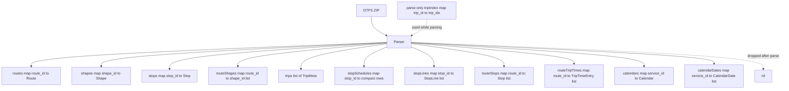
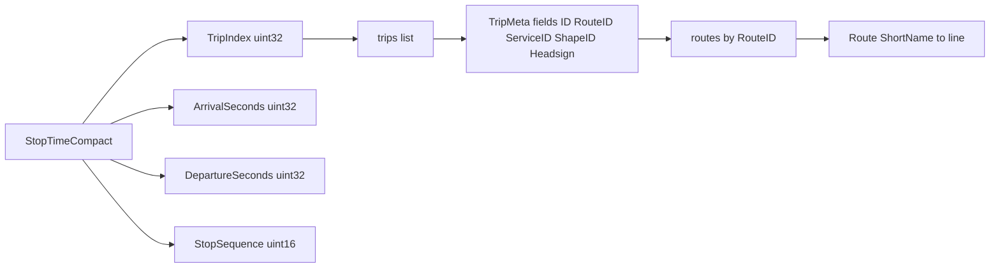
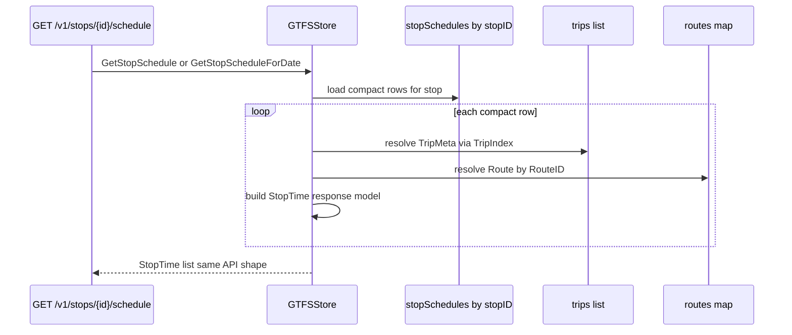
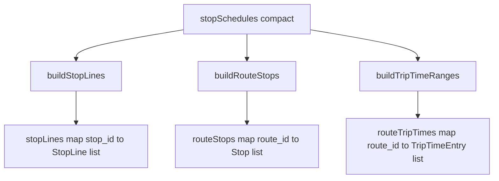
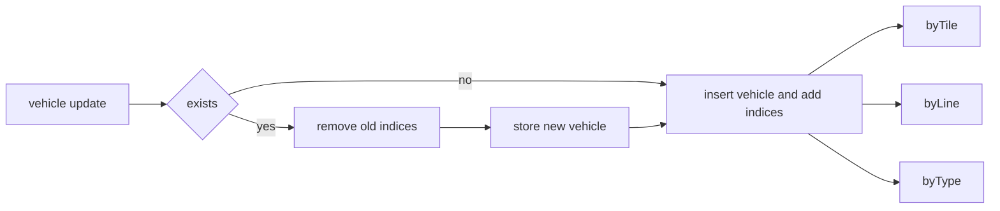

# GTFS Memory Model & Index Logic

This document describes the optimized GTFS in-memory structures and index-building flow.

## 1) High-level GTFS data pipeline

---

## 2) Compact stop_times representation

### Why this is smaller

Instead of storing repeated strings per stop-time row (`trip_id`, `route_id`, `service_id`, `line`, `headsign`, `arrival_time`, `departure_time`), each row stores mostly numeric fields and a compact trip index.

---

## 3) API read/decode flow

---

## 4) Derived indices build flow

---

## 5) Vehicle index update logic (separate fix)

This prevents stale `byLine` / `byType` index growth when vehicle attributes change.
